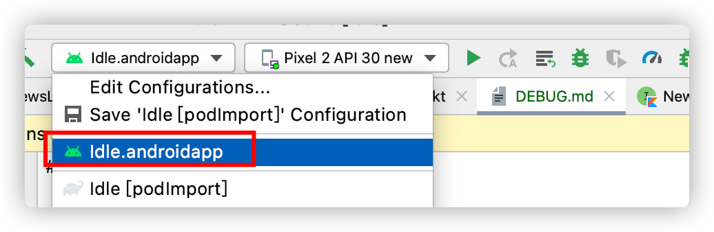
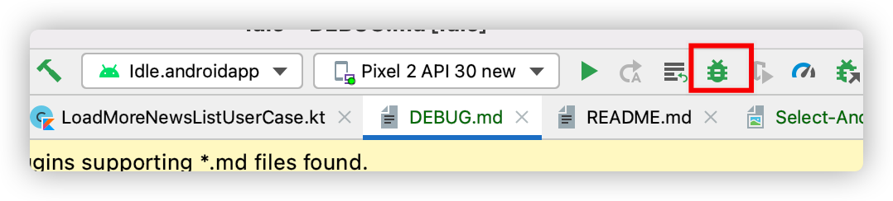
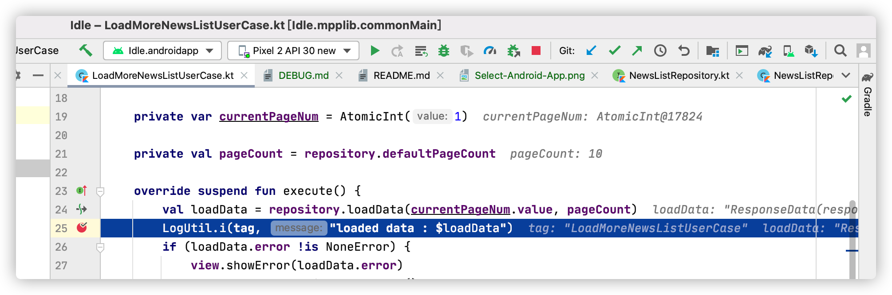
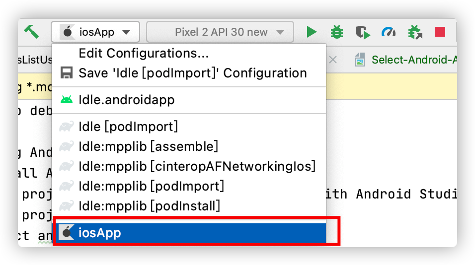
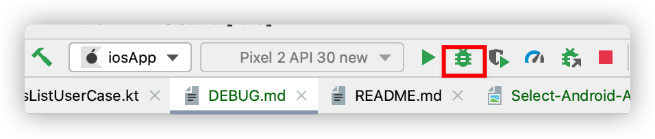
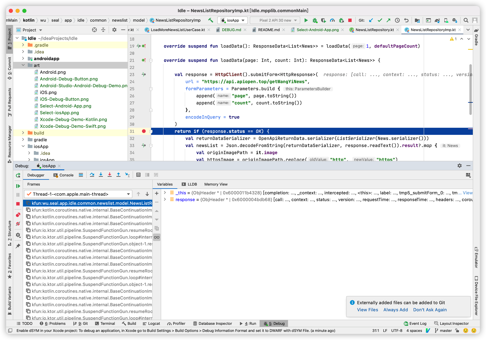
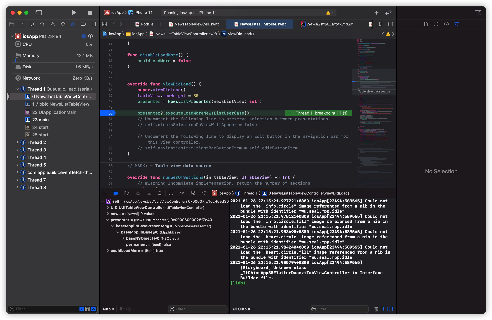
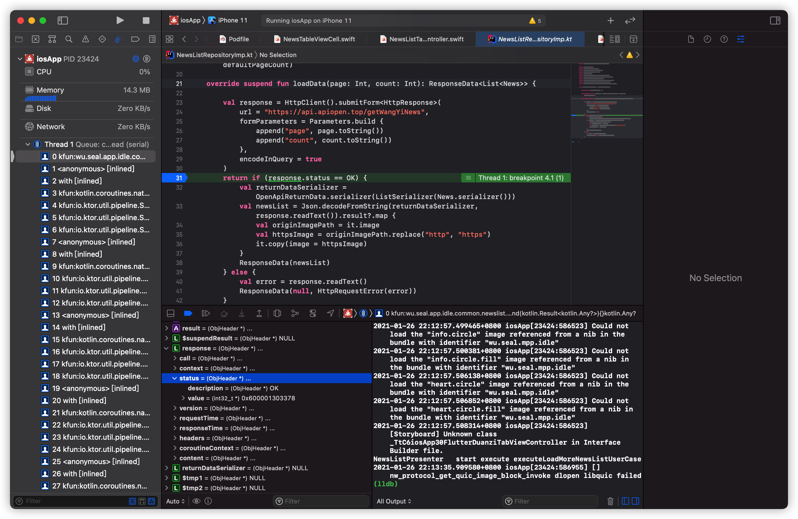

# How to debug app

## Debug Android App
1. Install Android Studio
2. Open project's file `settings.gradle.kts` with Android Studio
3. Sync project with gradle files
4. Select androidapp

5. Click Debug button

Start Debug| Debugging
-|-
|

## Debug only Kotlin code when running iOS App
1. Install Android Studio
2. [Install KMM Plugin](https://plugins.jetbrains.com/plugin/14936-kotlin-multiplatform-mobile?_ga=2.57666730.1088022082.1611568546-176801594.1605239277)
3. Open project's file `settings.gradle.kts` with Android Studio
4. Sync project with gradle files
5. Select iosApp

6. Click Debug button

Start Debug|Debugging
-|-
|

## Debug iOS App both Kotlin Code and Swift(Objc) Code
1. Install Xcode
2. [Install Xcode-Kotlin plugin](https://github.com/touchlab/xcode-kotlin)
3. Open `iosApp/iosApp.xcworkspace` with Xcode
4. Run pod install command in iosApp dir
5. Click debug button in Xcode
* Debug step into Swift

* Debug step into Kotlin Code

