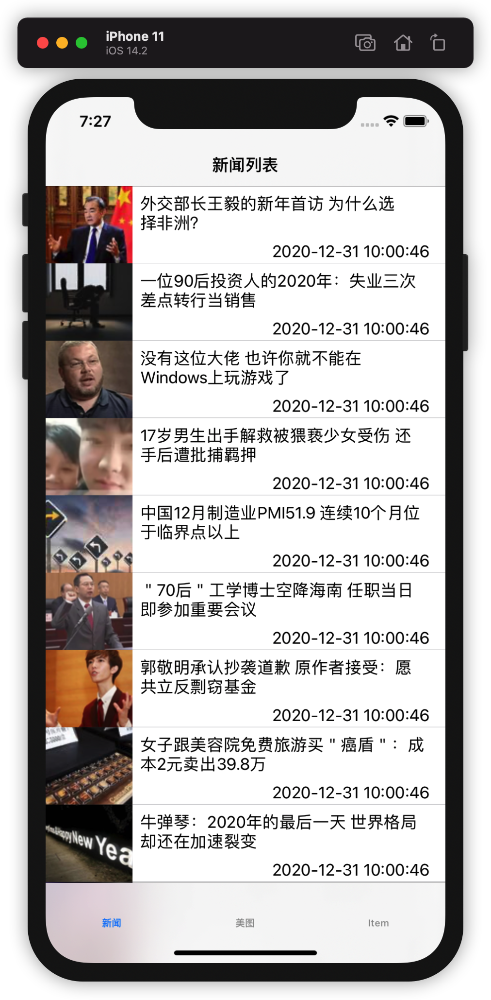
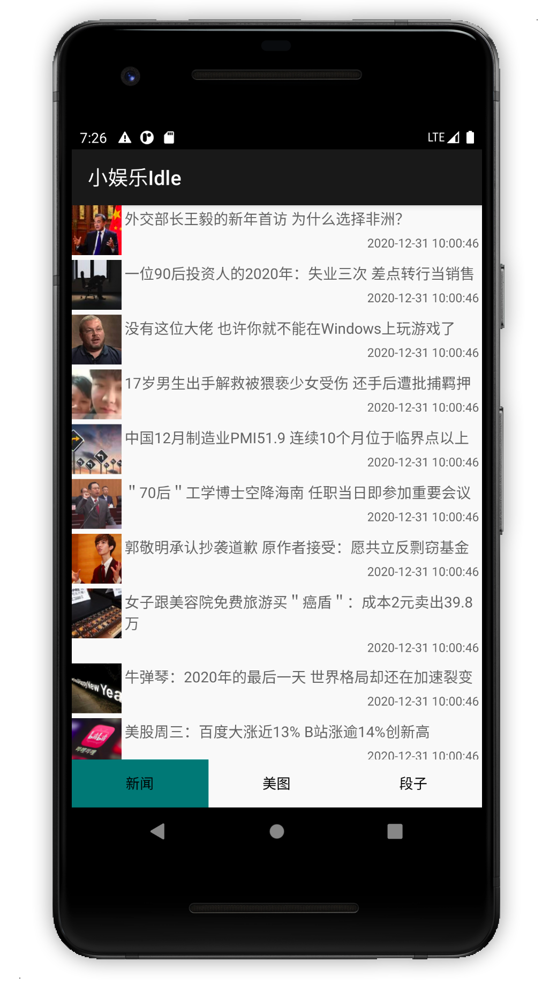

# Idle
Kotlin multiplatform app (Android&amp;iOS) that providing entertainment content

使用Kotlin跨平台技术实现的休闲App

iOS|Android
-|-
|

## 如何运行本工程
### 安装Android应用到手机或是模拟器
1. 环境准备
Android应用的构建安装可以在Windows&Linux&MacOS上进行，在开始构建应用进行安装前，需要确保你的电脑开发环境有如下内容
   * 成功安装了JDK8(为确保没有问题，尽量安装java 8的版本),切记一定是JDK！
   * 成功安装了Android Studio或是Android SDK
   * 设置ANDROID_SDK_ROOT环境变量
    
2. Clone本工程到本地
3. 在Clone下来的工程根目录下打开终端
4. 执行安装Android应用指令，确认当前有连接到Android设备或是已经打开Android模拟器
    ```./gradlew installDebug```
   
### 安装运行iOS应用到iphone或是iOS模拟器
1. 环境准备
iOS应用的安装运行仅能在MacOS系统上进行，在开始构建应用进行安装前,需要确保你的电脑开发环境有如下内容
   * 成功安装了JDK8(为确保没有问题，尽量安装java 8的版本),切记一定是JDK！
     MacOS可以用这个命令安装：`brew install --cask adoptopenjdk8`(最新Brew的指令)
   * 成功安装了cocoaspods
   * 成功安装了XCode并且可以打开一个正常的工程
    
2. Clone本工程到本地
3. 使用Xcode打开本工程目录下的`iosApp/iosApp.xcworkspace`
4. 在iosApp目录下打开终端，并执行`pod install`
5. Xcode选择对应的iphone设备或模拟器
6. 点击运行按钮，稍等一段时间，即可看到iOS应用成功安装到手机上并打开，如上图所示。


